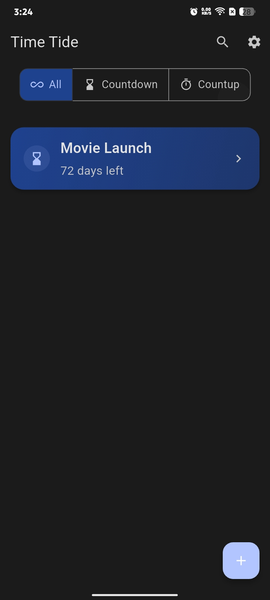
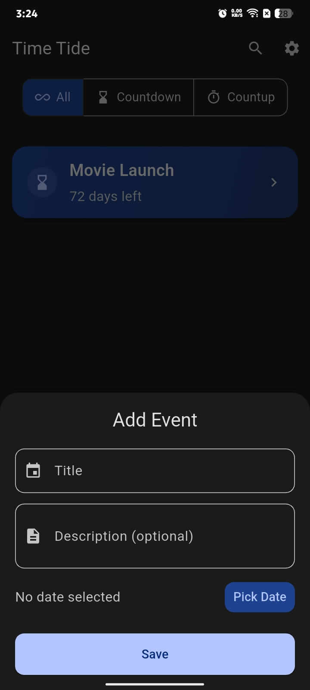
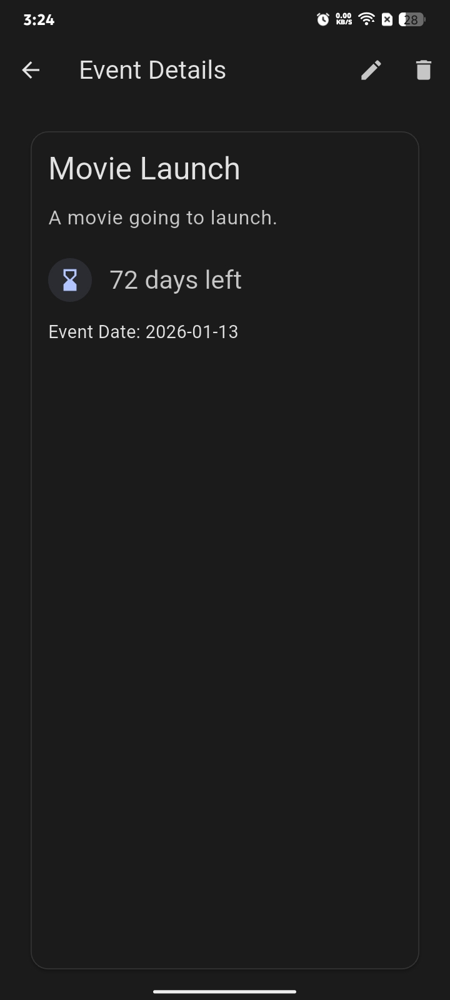
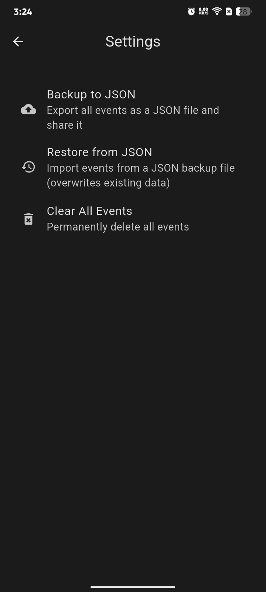
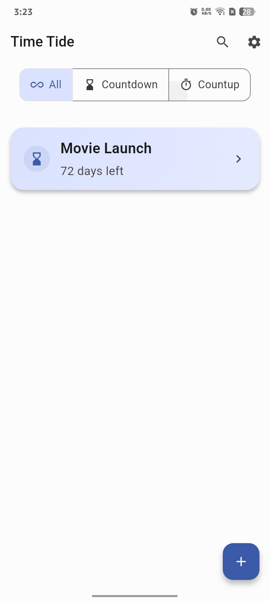
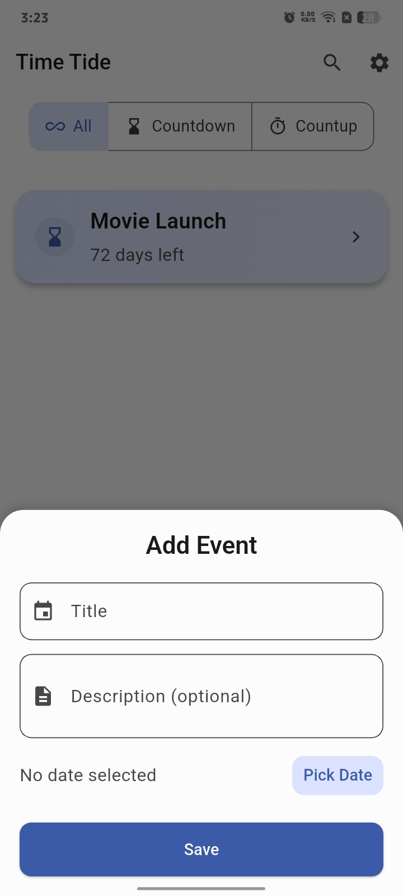
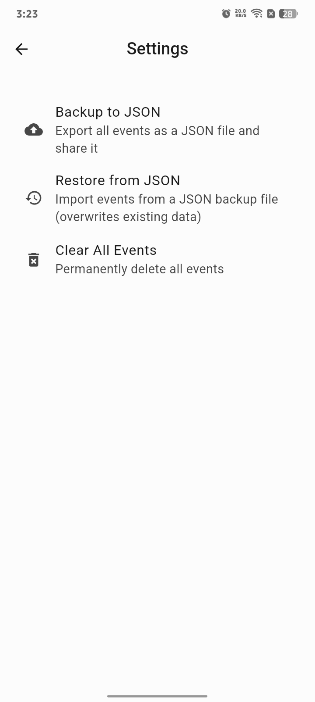

# ⏳ TimeTide

  
  
  
  
  
  

---

### 🧠 Overview

**TimeTide** is a simple and elegant countdown & countup tracker built with **Flutter** using **Material Design 3 (MD3)**.  
It helps you track important events, milestones, and deadlines — cleanly and beautifully.  

I made this app because most countdown apps felt cluttered or dull.  
**TimeTide** focuses on minimalism, speed, and smooth experience.

---

## ✨ Features

| Feature | Description |
|:--------|:-------------|
| 🧭 **Material You (MD3)** | Clean, adaptive, and modern design |
| 🌙 **Auto light/dark theme** | Matches your system theme automatically |
| 🔍 **Live search** | Instantly find events |
| 📅 **Smart filters** | Switch between All, Countdown, and Countup |
| 💾 **Backup & restore** | Save and load events using JSON |
| ⚡ **Offline-first** | Works completely offline |
| 🎉 **Animated UI** | Smooth and natural transitions |

---

## 📸 Screenshots

### 🌙 Dark Theme

  
  
  
  

---

### ☀️ Light Theme

  
  
  
  

---

## 💡 Contributing

Contributions and ideas are always welcome.  
Please open an issue before creating a pull request.

---

## ⭐ Support

If you find **Time tide** useful, please **star ⭐**.

---

## 📜 License

Licensed under the **GNU General Public License v3.0 (GPLv3)**.  
See [LICENSE](LICENSE) for details.
